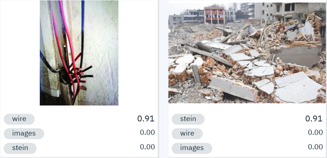
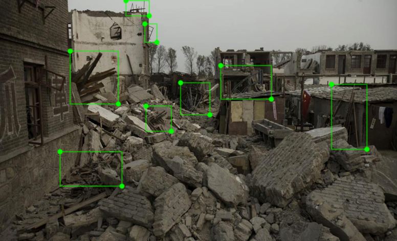
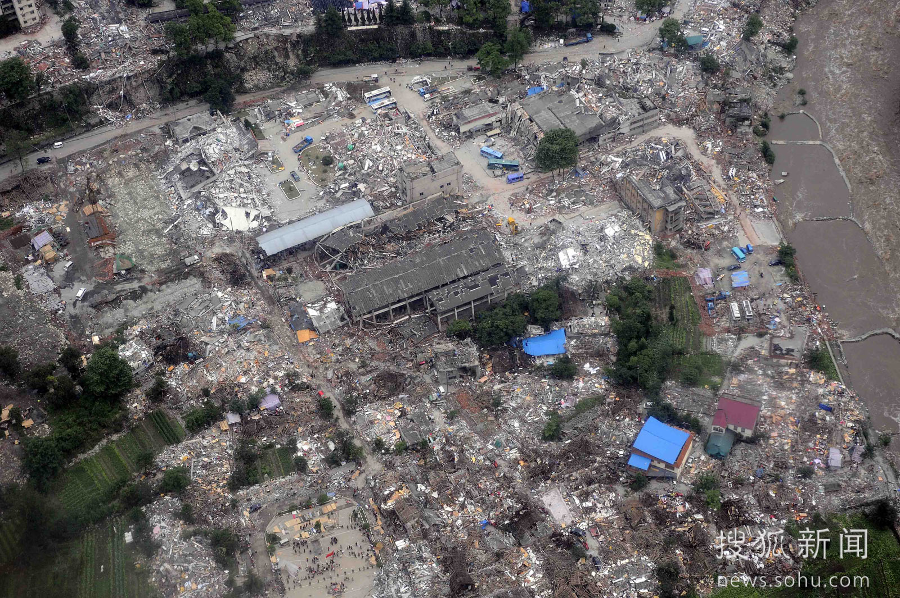
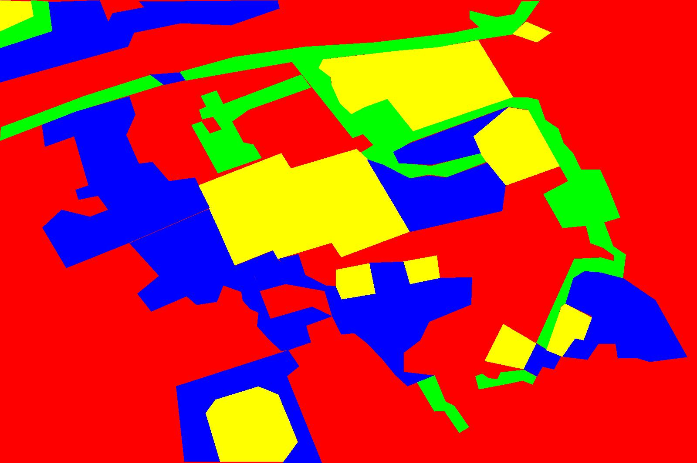
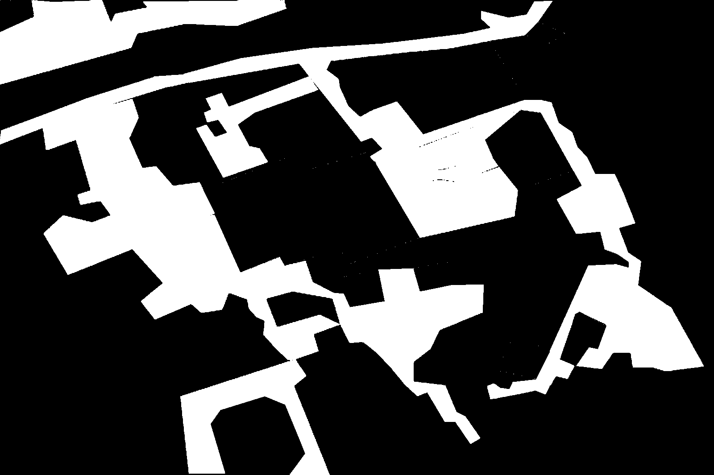
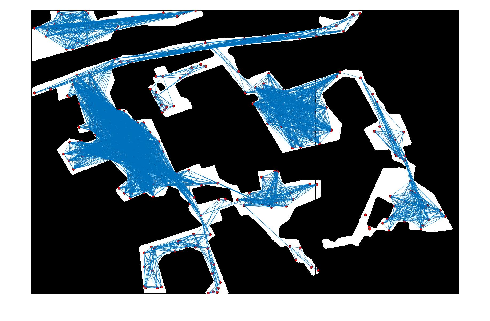
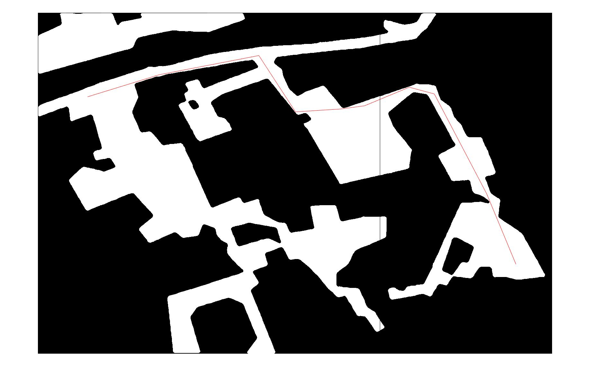

# Post-disaster-rescue-assessment-support-system
IBM Call For Code 2019 in Shanghai
We(Jin Li, Yaoming Wang, Bowen Shi, Jixiang Luo)join this activity and make up this idea.

## Notice:
Since images or videos of post disaster are unaccessible for us by now, our models was trained with weakly related dataset. Thus, the performance of our model are uncertained. We use labeled image as the result of semantic segmentation model for the sake of presentation.

## Object Detection
In this section, What we do is just collecting the related images with dangerous objects, such as leakage wire, sharp item, corrupted house and so on. Then we feed them into the Watson for visual recognition on IBM cloud. Here is our outcome for classifying images and detecting objects:
* Image classification:



For now, we have not trained the whole model of object detection, we just divde the input image into serveral pieces. And then we classify each piece and label the object, at last merge these pieces. Here are our examples for detection:



More details is [here!](https://github.com/smileformylove/Post-disaster-rescue-assessment-support-system/blob/master/object%20detection/README.md "With a Title")

## Semantic Segmentation: 
Details for this part could see [here!](https://github.com/smileformylove/Post-disaster-rescue-assessment-support-system/blob/master/Tensorflow-SegNet/README.md "With a Title"). 

## Path Programming:
### Example
```
cd workspacce
```


* Image captured by drone:



* Result of semantic segmentation:



```
python ss-bmp.py
```


* Convert semantic picture to bitmap:



```
matlab
astart
```


* Bitmap with random sign:



* The optimal path from source point to destination:


## Other Backup Codes:
* create_mask: Creat 0/1 mask for initial maps.
* dfs-construction: Use dfs to create road maps and the weight of roads on the basic of 0/1 mask. (But this code is time-consuming)
* generate_graph.py: Quickly generate road maps for demonstration (But can not get the weight of roads) 
* floyd-optimized_path: Use floyd algorithm to get final road planning 
